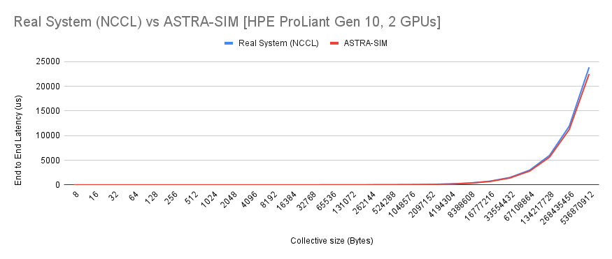
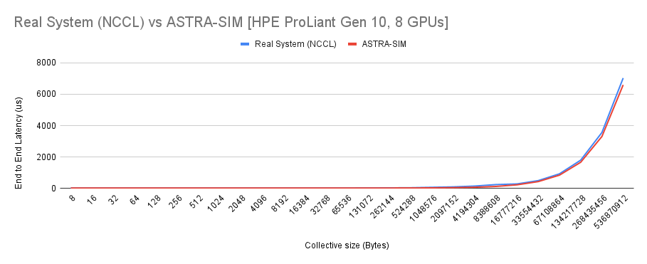

# Validation on GPU Systems - NCCL over HPE ProLiant Gen10

## Senario - 1: 2-GPUs All-Reduce
### Hardware Setup
1. 2 GPUs connected in ring
2. Each GPU has 6 NVLINKs at 25 GB/s
3. NCCL ring Algorithm

### ASTRA-Sim setup
1. Modelled with the ASTRA-Sim Analytical Backend
2. Bidirectional Ring

### Collectives run
1. All-Reduce
2. Reduction operation - Sum

### Results

**Geomean error rate = 11.4%**

## Senario - 2: 4-GPUs All-Reduce
### Hardware Setup
1. 4 GPUs connected in ring
2. Each GPU has 6 NVLINKs at 25 GB/s
3. NCCL ring Algorithm

### ASTRA-Sim setup
1. Modelled with the ASTRA-Sim Analytical Backend
2. Bidirectional Ring

### Collectives run
1. All-Reduce
2. Reduction operation - Sum

### Results

**Geomean error rate = 7.9%**

## Senario - 3: 8-GPUs All-Reduce
### Hardware Setup
1. 8 GPUs connected in a hybrid cube mesh:

2. Each GPU has 6 NVLINKs at 25 GB/s
3. NCCL ring Algorithm

### ASTRA-Sim setup
1. Modelled with the ASTRA-Sim Analytical Backend
2. 3 Bidirectional Rings

### Collectives run
1. All-Reduce
2. Reduction operation - Sum

### Results

**Geomean error rate = 2.8%**

## Recommended practices
1. Emperically extract warm up latency by running smaller collectives
2. Emperically extract practical link latency by first running smaller collectives and varying number of NPUs/GPUs

For more information contact Saeed Rashidi (saeed.rashidi@gatech.edu)